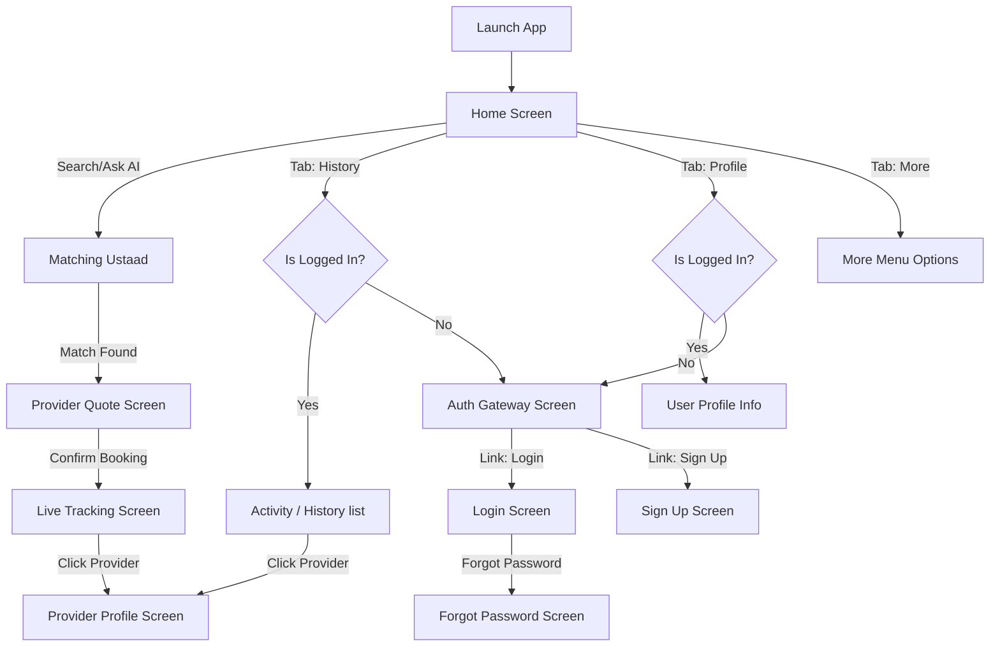

# Ustaad Mobile App Design Specification for Stitch

This document contains the specifications, styling guidelines, screen lists, and user flows for the **Ustaad** mobile application. Please use these guidelines to design the visual structure, layout, and components for all app screens.

---

## 🎨 Theme & Color Guidelines

To maintain consistent branding, you must strictly adhere to the following color palette. The UI follows the **60-30-10 color psychology rule** (60% background/canvas, 30% structure/text, 10% accent/CTAs).

### 60% Dominant (Canvas & Backgrounds)
- **Primary Background**: `#F8FAFC` (Clean, ghost white background for body layout)
- **Card Background**: `#FFFFFF` (Pure white for raised cards, lists, and elements)

### 30% Secondary (Structure, Typography & Primary Actions)
- **Header & Navigation Background**: `#1C1C1E` (Lighter Charcoal Black for navigation bars, header pills, and solid UI elements)
- **Primary Text Color**: `#1C1C1E` (Dark charcoal for titles, high-emphasis text)
- **Secondary Text Color**: `#475569` (Slate grey for descriptions, sub-headings, and captions)
- **Borders & Dividers**: `#E2E8F0` (Light grey for card borders, separation lines)

### 10% Accent (CTAs, Highlights & Action Items)
- **Primary Accent / Highlight**: `#F59E0B` (Vibrant Amber for primary actions like submit, select, active tab indicators, and glows)
- **Primary Accent Hover / Active State**: `#D97706` (Slightly darker amber for pressed button states)

### Status Colors
- **Success State**: `#10B981` (Emerald green for matched success, completed tasks, green radar signals)
- **Error State**: `#EF4444` (Vibrant red for alert warnings, cancel buttons, error notifications)

*Note: Let Stitch decide the precise placement of shadows, gradients, font sizing, and visual structural elements for these screens.*

---

## 📱 Navigation & Common Shell Elements

### 1. Bottom Navigation Bar
- **Style**: Custom dynamic tab bar anchored to the bottom.
- **Background**: `#1C1C1E` (Charcoal Black) with no top corner radius (flat design), with proper safe-area padding at the bottom.
- **Tabs**: 4 Tabs (Home, History, Profile, More).
- **Behavior**: 
  - Inactive tabs: Show **icon only** in white.
  - Active tab: Dynamically expands in width and displays both the **icon and text label side-by-side** in Vibrant Amber (`#F59E0B`) with a semi-transparent amber pill background.
  - The transition of widths and labels is animated smoothly.

### 2. Floating Header Pill
- **Style**: Floating rounded card (`borderRadius: 16`) at the top of every screen.
- **Background**: `#1C1C1E` (Charcoal Black).
- **Margin**: Floating with `marginHorizontal: 16` and top spacing calculated from the device status-bar inset.
- **Behavior**:
  - Main tab screens: Displays centered title text in white.
  - Sub-screens / Modals: Displays a back chevron button on the absolute left, with the title text remaining perfectly centered.

---

## 🔁 User Flows & Screen Hierarchy

---

## 🖥️ Screen Specifications

### 1. Home Screen (App Entry Point)
- **Behavior**: The app lands directly on the Home Screen instead of the OTP prompt.
- **Content**: 
  - Casual and warm localized Urdu greeting header/message.
  - Fast-action suggestion pills directly underneath the greeting (e.g., Plumber, Electrician, AC Repair).
  - Main natural language input field at the bottom of the screen (above the tab bar) for typing custom service requests.
  - Floating microphone button next to the input field for Roman Urdu/English voice input.
  - Touches outside the input field should dismiss the keyboard.

### 2. Authentication Gateway & Screens
Whenever an unauthenticated user tries to access the **History** or **Profile** tabs, they are redirected to the Auth flow:
- **Auth Gateway Screen**: Displays a prompt stating that logging in is required to view history or profile details, with clear "Sign In" and "Create Account" buttons.
- **Login Screen**: Fields for user credentials (phone/email, password) and link to sign up or recover password.
- **Sign Up Screen**: Registration form for new users (full name, phone, password, location setup).
- **Forgot Password Screen**: Prompt to recover password via phone/email verification code.
- **Related Auth Screens**: Verification/OTP entry screens for confirming account creation or password reset.

### 3. History Screen (Activity Logs)
- **Conditional Display**:
  - **If Logged In**: Displays the user's past and current service requests, booking details, status logs (e.g., Completed, Cancelled), pricing, and provider details.
  - **If Not Logged In**: Shows a clean, placeholder screen explaining that history is only available for registered users, alongside a prominent "Log In / Register" CTA button.

### 4. Profile Screen (User Settings)
- **Conditional Display**:
  - **If Logged In**: Shows user profile information (Name, Phone number, Saved addresses, Payment methods, Settings).
  - **If Not Logged In**: Shows a friendly notice to log in to manage settings, with a prominent "Log In" button.

### 5. More Screen (Utility & Secondary Links)
- **Style**: List/menu format of links.
- **Content**:
  - Change Language (Urdu, English, etc.)
  - Contact Customer Support
  - Help Center / FAQs
  - Terms of Service & Privacy Policy
  - About Ustaad App
  - **Logout Button** (Only visible if the user is currently logged in)

### 6. Provider (Ustaad) Profile Screen
- **Entry**: Accessed by clicking on a provider's card from the matching, tracking, or booking history.
- **Content**:
  - Professional summary, name, verified badge, and skill category.
  - Average ratings (stars) and feedback reviews from past customers.
  - Total completed bookings/jobs.
  - Service specialization tags (e.g., Water Tank Repair, Fan Installation).
  - Quick action to contact or choose this provider.
