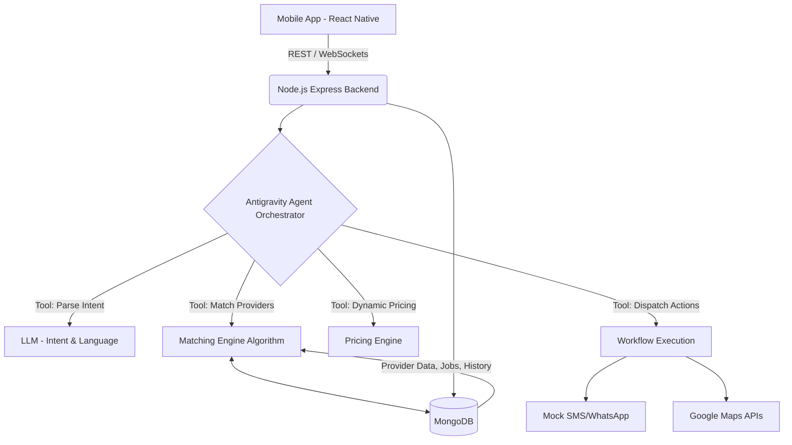

# Ustaad: AI Service Orchestrator for Informal Economy - Implementation Plan

This document outlines the architecture, technology stack, and step-by-step development plan for building the AI Service Orchestrator mobile application. 

## 1. Problem Overview
The objective is to build an intelligent mobile platform that connects users with informal service providers (plumbers, electricians, etc.) using natural language processing. The system must handle multilingual inputs (Urdu, Roman Urdu, English), extract intent, match providers using a multi-factor algorithm, handle dynamic pricing, and manage the full service lifecycle, including disputes and quality loops.

## 2. Technology Stack & Architecture Recommendation

To build a professional, scalable, and cross-platform mobile application rapidly while integrating complex AI workflows, I propose the following stack:

### Frontend (Mobile App)
- **Framework**: **React Native (with Expo)**. Provides a single codebase for both iOS and Android, fast refresh for rapid prototyping, and excellent ecosystem support.
- **Styling**: **Internal CSS (`StyleSheet`)**. We will use React Native's built-in `StyleSheet` API to ensure high stability and avoid external styling dependency issues.
- **State Management**: **Zustand** for lightweight and scalable client-side state management, combined with React Query if complex server-state sync is needed.
- **Maps Integration**: `react-native-maps` for tracking and location selection.

### Backend (API & AI Orchestrator)
- **Framework**: **Node.js (Express)**. Node.js is excellent for highly concurrent, event-driven applications like ours. The JavaScript/TypeScript ecosystem has mature AI libraries (like `@google/genai` or `langchain.js`) allowing us to build the agentic orchestration directly in Node.js.
- **AI Orchestrator (Antigravity)**: A dedicated agentic layer built within Node.js that uses LLMs (e.g., Google Gemini) to power the "Google Antigravity" reasoning traces. It will manage intent extraction, multi-factor matching, dynamic pricing, and dispute workflows using a structured Agent loop.
- **Database**: **MongoDB**. A NoSQL database is a great fit here as it allows for flexible schema design. Storing unstructured service request data, variable provider skills, and dynamically evolving booking logs is highly efficient in MongoDB. Mongoose will be used for schema validation.

### External APIs & Integrations
- **Location & Routing**: Google Maps Platform (Places API, Distance Matrix API) - fully supported and reliable in Pakistan.
- **Notifications**: WhatsApp Business API (Meta Cloud API) as WhatsApp is universally used in Pakistan. For SMS (if required in production), we would use local gateways (e.g., PakSMS, Jazz/Telenor APIs) to comply with PTA regulations and avoid high international rates. For this prototype, notifications will be simulated.
- **Authentication**: Firebase Phone Auth for robust OTP verification with Pakistani numbers (+92).
- **Voice-to-Text**: `@react-native-voice/voice` or Expo Audio integrated with Google Cloud Speech-to-Text API for robust Urdu/Roman Urdu audio parsing.

---

## Resolved Requirements
- **Authentication**: A full functional Auth flow will be implemented using Firebase Phone Auth (OTP) and JWTs on the Node.js backend.
- **Map UI**: A live map visualizer will be integrated using `react-native-maps` to show provider location and "en-route" status dynamically.
- **Voice Input**: Actual Voice-to-Text (speech recognition) will be supported for multilingual audio input, alongside standard text input.

> [!IMPORTANT]
> **Plan Status**: All requirements have been clarified. Awaiting final user approval to begin execution (Phase 1).

---

## 3. System Architecture Diagram

---

## 4. Proposed Development Phases

### Phase 1: Foundation & Data Modeling (Days 1-2)
- Set up React Native (Expo) project structure.
- Set up Node.js (Express) backend.
- Design MongoDB schema using Mongoose:
  - `Users` (Customers)
  - `Providers` (Skills, Location, Ratings, Metrics)
  - `ServiceRequests` (Intent, Status)
  - `Bookings` (Scheduling, Pricing, State)
- Generate and seed mock provider data for various informal services.

### Phase 2: Core AI Agent Orchestrator (Days 3-4)
- Implement the "Antigravity" Agent in Node.js.
- **Intent Extraction**: Prompt engineering to parse Urdu/Roman Urdu/English and extract structured JSON (Service, Location, Urgency, Budget).
- **Matching Algorithm**: Develop the multi-factor ranking algorithm (combining distance, rating, cancellation rate, skill match, etc.).
- **Dynamic Pricing**: Create the pricing logic factoring in demand, urgency, and base rates.

### Phase 3: Mobile App UI & State (Days 5-6)
- Develop modern, aesthetic screens using `StyleSheet`:
  - Home / Natural Language Input Screen
  - Provider Matching & Quote Display Screen (showing Agent Reasoning)
  - Active Booking / Tracking Screen
  - Feedback & Dispute Screen
- Integrate frontend with Node.js backend.

### Phase 4: Workflow Simulation & Edge Cases (Days 7-8)
- Implement the state machine for the booking lifecycle (Requested -> Matched -> Confirmed -> En-route -> Completed/Disputed).
- Implement stress-test scenarios:
  - Simulating a provider cancellation and automatic re-matching.
  - Handling low-confidence NLP parsing (fallback to clarifying questions).
  - Simulating customer disputes.

### Phase 5: Polish & Deliverables Generation (Days 9-10)
- Capture agent reasoning traces and expose them in the UI (or developer console) as required by the prompt.
- Prepare the Demo Video.
- Finalize the comprehensive README (architecture, datasets, algorithms).

---

## 5. Verification Plan

### Automated/System Tests
- **NLP Tests**: Run a suite of 20+ mixed language (Roman Urdu/English) strings through the intent extractor to verify high accuracy.
- **Matching Algorithm Tests**: Assert that given a specific user criteria (e.g., "high budget, needs specialist"), the algorithm correctly penalizes generic providers and ranks specialists higher, even if further away.

### Manual Verification
- Walk through the exact "EXAMPLE SCENARIO" provided in the prompt end-to-end on the mobile simulator.
- Manually trigger all 5 "RECOMMENDED STRESS-TEST SCENARIOS" and ensure the Agent Orchestrator handles them gracefully.
