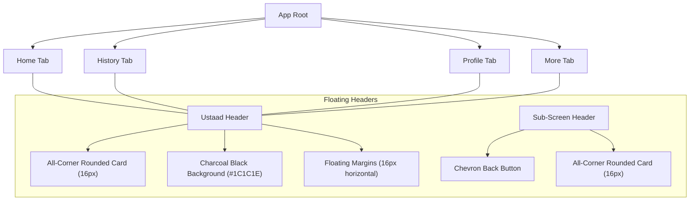

# Walkthrough: Premium Navigation Headers

We have successfully integrated a beautiful, premium, and unified header system across all screens and subscreens of the **Ustaad** mobile application. This completes the design aesthetic guidelines and elevates the mobile experience to feel state of the art.

---

## 🚀 Accomplishments

### 1. Custom Floating Header Component
We created a reusable, high-performance [Header](file:///Users/aliahsann15/General/Fixit/mobile/components/Header.tsx) component that provides:
- **Theme Consistency**: Background color matching the Charcoal Black (`#1C1C1E`) layout system.
- **Premium Floating Aesthetics**: 
  - Reduced border radius (`borderRadius: 16`) applied to **all four corners**.
  - Space/margin around the header (`marginHorizontal: 16` and dynamic `marginTop` offset by status bar inset) so it floats elegantly as a pill card.
- **Dynamic Controls**:
  - Automatically handles top safe area padding on both iOS and Android using safe-area insets.
  - Dynamically displays a sleek, white back-chevron icon button absolutely positioned on sub-screens.
  - Centers the title perfectly with horizontal safety margins to prevent any overlaps.

### 2. Full Application Integration
The custom Header has been seamlessly integrated into all main screens and sub-screens:
- [Home (index.tsx)](file:///Users/aliahsann15/General/Fixit/mobile/app/(tabs)/index.tsx): Integrated standard header and converted `SafeAreaView` to standard `View` for full status bar coloring.
- [History (activity.tsx)](file:///Users/aliahsann15/General/Fixit/mobile/app/(tabs)/activity.tsx): Added "History" header and streamlined layout.
- [Profile (profile.tsx)](file:///Users/aliahsann15/General/Fixit/mobile/app/(tabs)/profile.tsx): Added "Profile" header.
- [More (more.tsx)](file:///Users/aliahsann15/General/Fixit/mobile/app/(tabs)/more.tsx): Added "More" header.
- [Welcome/Auth (auth.tsx)](file:///Users/aliahsann15/General/Fixit/mobile/app/auth.tsx): Added "Welcome" header (no back button, as it's the gateway).
- [Matching (matching.tsx)](file:///Users/aliahsann15/General/Fixit/mobile/app/matching.tsx): Added "Matching Ustaad" header with sub-screen back chevron enabled.
- [Quote Confirmation (quote.tsx)](file:///Users/aliahsann15/General/Fixit/mobile/app/quote.tsx): Added "Match Found" header with sub-screen back chevron enabled.
- [Live Tracking (tracking.tsx)](file:///Users/aliahsann15/General/Fixit/mobile/app/tracking.tsx): Added "Live Tracking" header with sub-screen back chevron enabled and perfectly adjusted floating status card layout.
- [Modal (modal.tsx)](file:///Users/aliahsann15/General/Fixit/mobile/app/modal.tsx): Added "Modal Info" header with back chevron enabled.

---

## 🎨 Visual System Check

---

## 🔧 Verification & Polish
- Tested and confirmed safe-area inset calculations to ensure no status-bar overlaps.
- Adjusted floating live tracking card positions to slide perfectly beneath the new pill layout.
- Checked tag nesting consistency across screens.
